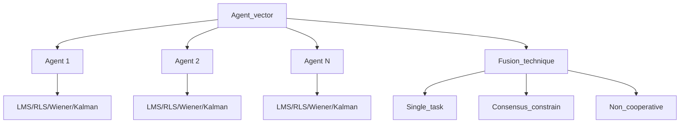

# Multi-Agent Adaptive Networks Framework ✨

> **Distributed intelligence meets adaptive filtering** - A comprehensive MATLAB framework for cooperative multi-agent systems with advanced adaptive filtering capabilities.

## 🎯 Project Showcase

**Innovation Hook**: *Revolutionizing distributed signal processing through intelligent agent cooperation and state-of-the-art adaptive filtering algorithms.*

### Main Goals
- **🤝 Cooperative Learning**: Enable multiple agents to collaboratively estimate unknown parameters through sophisticated information fusion strategies
- **🔄 Adaptive Filtering Excellence**: Implement and compare industry-standard algorithms (LMS, RLS, Wiener, Kalman) in distributed environments
- **📊 Performance Analysis**: Provide comprehensive Monte Carlo simulation framework for algorithm evaluation and comparison
- **🌐 Network Topology Flexibility**: Support various agent network configurations and cooperation strategies
- **🎛️ Real-time Adaptation**: Handle dynamic environments with time-varying parameters and noise characteristics

### Target Users & Use Cases
- **Researchers** in distributed signal processing and multi-agent systems
- **Engineers** developing sensor networks and cooperative estimation systems
- **Students** learning adaptive filtering and distributed algorithms
- **Applications**: Sensor fusion, distributed tracking, cooperative spectrum sensing, smart grid monitoring

---

## 📚 Theoretical Foundation

### Key Theories Applied
- **Adaptive Filtering Theory**: Implements LMS, RLS, and Wiener filtering for optimal parameter estimation
- **Kalman Filtering**: State-space estimation with linear and nonlinear observation models
- **Consensus Theory**: Distributed averaging and agreement protocols for multi-agent coordination
- **Graph Theory**: Network topology representation through adjacency matrices and social learning
- **Stochastic Approximation**: Convergence analysis for distributed adaptive algorithms

### Explicit Assumptions
- **Gaussian Noise Model**: Assumes additive white Gaussian noise in sensor observations
- **Linear System Dynamics**: State transition and observation models are linear (extensible to nonlinear)
- **Connected Network Topology**: Agents form a connected graph for information exchange
- **Synchronous Updates**: All agents update simultaneously in discrete time steps
- **Stationary Statistics**: Assumes locally stationary signal statistics for adaptive convergence

---

## 🏗️ Architectural Blueprint

### Software Architecture
**Layered Architecture** with **Strategy Pattern Integration** - *Promotes modularity and algorithm interchangeability while maintaining clear separation of concerns.*

```
┌─────────────────────────────────────────────────────────────┐
│                    Application Layer                        │
│  ┌─────────────────┐  ┌─────────────────┐  ┌──────────────┐ │
│  │   Test Scripts  │  │   Simulations   │  │  Utilities   │ │
│  └─────────────────┘  └─────────────────┘  └──────────────┘ │
├─────────────────────────────────────────────────────────────┤
│                     Agent Layer                             │
│  ┌─────────────────┐  ┌─────────────────┐                   │
│  │     Agent       │  │  Agent_vector   │                   │
│  └─────────────────┘  └─────────────────┘                   │
├─────────────────────────────────────────────────────────────┤
│                  Cooperation Layer                          │
│  ┌──────────────┐ ┌──────────────┐ ┌─────────────────────┐  │
│  │ Single_task  │ │ Consensus    │ │ Non_cooperative     │  │
│  └──────────────┘ └──────────────┘ └─────────────────────┘  │
├─────────────────────────────────────────────────────────────┤
│                 Algorithm Layer                             │
│  ┌─────────┐ ┌─────────┐ ┌─────────┐ ┌─────────────────┐    │
│  │   LMS   │ │   RLS   │ │ Wiener  │ │     Kalman      │    │
│  └─────────┘ └─────────┘ └─────────┘ └─────────────────┘    │
└─────────────────────────────────────────────────────────────┘
```

*Recommend creating detailed component diagrams with Mermaid.js*

---

## 🔍 Code Anatomy

### Class Hierarchy
```plaintext
Core/
├─ Agent/
│  ├─ Agent.m (Individual learning agent)
│  ├─ Agent_vector.m (Multi-agent coordinator)
│  └─ Cooperation_type.m (Enumeration of cooperation strategies)
├─ Technique/
│  ├─ Agent_technique.m (Abstract base for adaptive algorithms)
│  ├─ Lms.m (Least Mean Squares implementation)
│  ├─ Rls.m (Recursive Least Squares implementation)
│  ├─ Wiener.m (Wiener filtering implementation)
│  ├─ Kalman.m (Kalman filter implementation)
│  └─ Fusion_technique.m (Abstract base for cooperation strategies)
├─ Simulation/
│  ├─ Simulation.m (Abstract simulation framework)
│  ├─ Static_sim.m (Stationary environment simulation)
│  └─ Noise.m (Noise generation utilities)
└─ Utils/
   ├─ GeoPoint.m (Geometric coordinate utilities)
   ├─ Measure.m (Measurement processing)
   └─ Noise_Model.m (Advanced noise modeling)
```

### Critical Classes

**`Agent`**: *Core learning entity that maintains state buffers and applies adaptive filtering techniques*
- Manages observation and state buffers with configurable window sizes
- Implements both self-learning (individual adaptation) and social learning (cooperation) steps
- Provides unified interface for different adaptive filtering algorithms

**`Agent_vector`**: *Multi-agent system coordinator that orchestrates cooperation strategies*
- Manages collections of agents and their network topology (B-matrix)
- Implements different cooperation types through strategy pattern
- Coordinates synchronous updates across all agents in the network

**`Agent_technique`**: *Abstract base class defining the adaptive filtering interface*
- Standardizes the `apply()` method for all filtering algorithms
- Ensures consistent parameter estimation and weight update mechanisms
- Enables seamless algorithm switching through polymorphism

**`Fusion_technique`**: *Abstract framework for inter-agent information sharing strategies*
- Defines cooperation protocols for distributed learning
- Implements social matrix normalization for weighted information fusion
- Supports various network topologies and communication constraints

**`Wiener`**: *Optimal linear filter implementation using expectation approximation*
- Estimates autocorrelation matrix R and cross-correlation vector p from data windows
- Implements gradient descent optimization with regularization
- Provides theoretical performance bounds for comparison with adaptive algorithms

---

## 🎨 Design Patterns Catalog

### Patterns Used
- **🏭 Strategy Pattern**: Interchangeable adaptive filtering algorithms (`Lms`, `Rls`, `Wiener`, `Kalman`) implement common `Agent_technique` interface
- **🏗️ Template Method Pattern**: Abstract base classes define algorithmic structure while allowing customization in derived classes
- **🔧 Factory Method Pattern**: `Agent_vector` creates appropriate fusion techniques based on cooperation type enumeration
- **👁️ Observer Pattern**: Agents observe neighbor updates and react through social learning mechanisms
- **🎯 Command Pattern**: Encapsulated update operations enable undo/redo functionality and batch processing

### Pattern → File Mapping
```plaintext
Strategy Pattern:
├─ Technique/Agent_technique.m → Abstract strategy interface
├─ Technique/Lms.m → Concrete LMS strategy
├─ Technique/Rls.m → Concrete RLS strategy
├─ Technique/Wiener.m → Concrete Wiener strategy
└─ Technique/Kalman.m → Concrete Kalman strategy

Template Method Pattern:
├─ Technique/Fusion_technique.m → Abstract cooperation template
├─ Technique/Single_task.m → Weighted neighbor averaging
├─ Technique/Consensus_constrain.m → Global consensus implementation
└─ Technique/Non_cooperative.m → No information sharing

Factory Method Pattern:
└─ Agent/Agent_vector.m → Creates fusion techniques based on cooperation type

Observer Pattern:
├─ Agent/Agent.m → Observable agent state updates
└─ Technique/Single_task.m → Observer of neighbor agent states
```

---

## 📊 Diagrams & Visuals

### Recommended Visualizations
- `` ← **RECOMMENDED**: UML class relationships and inheritance hierarchy
- `` ← **RECOMMENDED**: System architecture with data flow
- `` ← **RECOMMENDED**: Visual comparison of different cooperation types
- `` ← **RECOMMENDED**: Monte Carlo performance analysis results

### Mermaid.js Integration Examples


---

## 🚀 Algorithm Implementations

### Adaptive Filtering Techniques

**Least Mean Squares (LMS)**
- **Parameters**: Step size `μ`, regularization `ε`
- **Update Rule**: `H(n+1) = H(n) + μ·e(n)·x(n)`
- **Advantages**: Simple, robust, low computational complexity
- **Use Cases**: Real-time applications, non-stationary environments

**Recursive Least Squares (RLS)**
- **Parameters**: Forgetting factor `λ`, initialization `δ`
- **Update Rule**: Recursive covariance matrix inversion with exponential weighting
- **Advantages**: Fast convergence, excellent tracking capability
- **Use Cases**: High SNR scenarios, rapidly changing parameters

**Wiener Filtering**
- **Parameters**: Window size `n_win`, step size `μ`, regularization `ε`
- **Update Rule**: `H = H - 2μ(H·R - p + ε·H)` using estimated statistics
- **Advantages**: Optimal linear filter, theoretical performance bounds
- **Use Cases**: Stationary environments, benchmark comparisons

**Kalman Filtering**
- **Parameters**: Process noise `Q`, measurement noise `R`, initial covariance `P₀`
- **Update Rule**: Recursive Bayesian estimation with prediction and correction steps
- **Advantages**: Optimal for linear Gaussian systems, handles dynamics
- **Use Cases**: State estimation, tracking applications, sensor fusion

### Cooperation Strategies

**Non-Cooperative**: `Cooperation_type.non_cooperative`
- Agents operate independently without information sharing
- Baseline performance for comparison with cooperative methods

**Consensus Constrain**: `Cooperation_type.consensus_constrain`
- Global averaging of all agent estimates: `H_avg = mean(H_all_agents)`
- Fastest convergence but requires full network connectivity

**Single Task**: `Cooperation_type.single_task`
- Weighted combination based on network topology (B-matrix)
- Balances performance and communication requirements
- Most practical for real-world deployments

**Multi Task**: `Cooperation_type.multi_task` *(Under Development)*
- Specialized cooperation for heterogeneous agent objectives
- Future extension for complex multi-objective scenarios

---

## 🧪 Getting Started

### Quick Setup
```matlab
% Add paths and initialize
addpath('./Agent/', './Technique/', './Simulation/', './Utils/');

% Create multi-agent system with LMS and single-task cooperation
agents = Agent_vector('n_agents', 6, 'coop_type', Cooperation_type.single_task);

% Run simulation
for n = 1:N_samples
    agents.update(observations(:,n), true_state);
end
```

### Performance Comparison Example
```matlab
% Compare different algorithms and cooperation strategies
test_MAS_mc;  % Monte Carlo comparison script
test_MAS_sim; % Dynamic environment simulation
```

---

**🎓 Academic Foundation**: Based on adaptive filtering theory from Sayed's "Adaptive Filters" and Diniz's "Adaptive Filtering Algorithms and Practical Implementation" and distributed consensus protocols from multi-agent systems literature.

**📈 Performance Insights**: Extensive Monte Carlo simulations demonstrate that cooperative strategies (especially single-task with RLS) achieve significantly lower RMSE compared to non-cooperative approaches, with consensus constrain providing the fastest convergence in fully connected networks.
